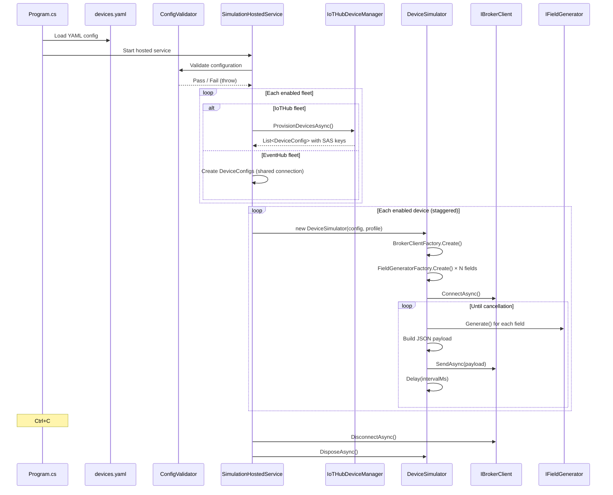

# Architecture

## Overview

MQTTSimulator is a .NET 8 console application built on the Generic Host (`Microsoft.Extensions.Hosting`). It simulates multiple IoT devices, each running as an independent async task, sending configurable telemetry to Azure IoT Hub, Azure Event Hubs, Azure Event Grid, or standard MQTT brokers.

## System Diagram

```mermaid
graph TB
    subgraph Entry["Startup"]
        Program["Program.cs<br/>.NET Generic Host"]
        YAML["devices.yaml<br/>YAML Configuration"]
        Program -->|loads| YAML
    end

    subgraph Config["Configuration Layer"]
        SimulatorConfig["SimulatorConfig<br/>profiles, devices, fleets,<br/>defaultInterval, connectionDelayMs"]
        ConfigValidator["ConfigValidator<br/>startup validation"]
        SimulatorConfig --> DeviceConfig["DeviceConfig<br/>id, profile, broker, interval"]
        SimulatorConfig --> FleetConfig["FleetConfig<br/>type, connection, prefix,<br/>count, profile"]
        SimulatorConfig --> Profiles["Profiles<br/>Dictionary&lt;string, FieldConfig&gt;"]
        DeviceConfig --> BrokerConfig["BrokerConfig<br/>type, host, connection,<br/>cert, key, hub<br/><i>auto: auth, port</i>"]
        Profiles --> FieldConfig["FieldConfig<br/>gen, min, max, step,<br/>values, amplitude, etc."]
    end

    subgraph Host["Simulation Engine"]
        SHS["SimulationHostedService<br/>IHostedService"]
        SHS -->|validates| ConfigValidator
        SHS -->|provisions| IoTHubDM["IoTHubDeviceManager<br/>REST API provisioning"]
        SHS -->|creates| EHFleet["EventHub Fleet Builder<br/>shares connection string"]
        SHS -->|spawns| DS["DeviceSimulator ×N<br/>one per device"]
    end

    subgraph Sim["Device Simulation Loop"]
        DS -->|creates| BrokerClientFactory["BrokerClientFactory"]
        DS -->|creates| FieldGeneratorFactory["FieldGeneratorFactory"]
        DS -->|loop| SendLoop["Connect → Generate → Send → Delay"]
        DS -->|updates| Display["ConsoleDisplay<br/>Spectre.Console live table"]
    end

    subgraph Brokers["Broker Clients (IBrokerClient)"]
        BrokerClientFactory --> IoTHubClient["IoTHubBrokerClient<br/>MQTT 3.1.1 via MQTTnet<br/>SAS token / X.509"]
        BrokerClientFactory --> EventHubClient["EventHubBrokerClient<br/>Azure.Messaging.EventHubs<br/>partition key = device ID"]
        BrokerClientFactory --> MqttMtlsClient["MqttMtlsBrokerClient<br/>MQTT + mutual TLS<br/>client cert + CA"]
        BrokerClientFactory --> MqttClient["MqttBrokerClient<br/>MQTT / MQTT+TLS<br/>user/pass or CA cert"]
    end

    subgraph Generators["Payload Generators (IFieldGenerator)"]
        FieldGeneratorFactory --> Increment["IncrementGenerator<br/>bouncing min↔max"]
        FieldGeneratorFactory --> Random["RandomRangeGenerator<br/>uniform random"]
        FieldGeneratorFactory --> Sine["SineWaveGenerator<br/>sinusoidal wave"]
        FieldGeneratorFactory --> Static["StaticGenerator<br/>constant value"]
        FieldGeneratorFactory --> Cycle["EnumCycleGenerator<br/>rotate through list"]
        FieldGeneratorFactory --> Timestamp["TimestampGenerator<br/>UTC ISO 8601"]
        FieldGeneratorFactory --> HashSelect["DeviceHashSelectGenerator<br/>deterministic by device ID"]
    end

    subgraph Helpers["Shared Utilities"]
        CertHelper["CertificateHelper<br/>PEM loading, PKCS12 re-export"]
        SasGen["SasTokenGenerator<br/>HMAC-SHA256 SAS tokens"]
        IntervalParser["IntervalParser<br/>5s / 500ms / 1m → ms"]
    end

    subgraph Targets["External Services"]
        IoTHub["Azure IoT Hub<br/>MQTT 3.1.1 :8883"]
        EventHub["Azure Event Hubs<br/>AMQP :5671"]
        EventGrid["Azure Event Grid<br/>MQTT + mTLS :8883"]
        MqttBroker["MQTT Broker<br/>Mosquitto, EMQX, etc.<br/>:1883 / :8883"]
    end

    IoTHubClient -->|MQTT| IoTHub
    EventHubClient -->|AMQP| EventHub
    MqttMtlsClient -->|MQTT+mTLS| EventGrid
    MqttClient -->|MQTT| MqttBroker

    IoTHubClient -.->|uses| CertHelper
    IoTHubClient -.->|uses| SasGen
    MqttMtlsClient -.->|uses| CertHelper
    MqttClient -.->|uses| CertHelper
    IoTHubDM -.->|uses| SasGen

    Program -->|configures| SHS

    subgraph Logging["Logging"]
        Serilog["Serilog<br/>File sink<br/>logs/simulator-*.log"]
    end

    DS -.->|logs| Serilog

    classDef entry fill:#4a9eff,stroke:#2a6fcf,color:#fff
    classDef config fill:#f0ad4e,stroke:#c77c00,color:#000
    classDef engine fill:#5cb85c,stroke:#3d8b3d,color:#fff
    classDef broker fill:#d9534f,stroke:#b52b27,color:#fff
    classDef generator fill:#9b59b6,stroke:#7d3c98,color:#fff
    classDef target fill:#1abc9c,stroke:#148f77,color:#fff
    classDef helper fill:#95a5a6,stroke:#717d7e,color:#000

    class Program,YAML entry
    class SimulatorConfig,ConfigValidator,DeviceConfig,FleetConfig,BrokerConfig,Profiles,FieldConfig config
    class SHS,IoTHubDM,EHFleet,DS,SendLoop,Display engine
    class BrokerClientFactory,IoTHubClient,EventHubClient,MqttMtlsClient,MqttClient broker
    class FieldGeneratorFactory,Increment,Random,Sine,Static,Cycle,Timestamp,HashSelect generator
    class IoTHub,EventHub,EventGrid,MqttBroker target
    class CertHelper,SasGen,IntervalParser,Serilog helper
```



## Startup Flow



## Project Structure

```
MQTTSimulator/
├── Program.cs                          # Host builder, YAML + Serilog setup
├── devices.yaml                        # Runtime config (git-ignored)
├── devices.sample.yaml                 # Config template with examples
├── appsettings.json                    # .NET host defaults
├── MQTTSimulator.csproj                # Project file + NuGet refs
│
├── Configuration/
│   ├── SimulatorConfig.cs              # Root config: profiles, devices, fleets
│   ├── DeviceConfig.cs                 # Per-device: id, profile, broker, interval
│   ├── FleetConfig.cs                  # Fleet: type, connection, prefix, count
│   ├── BrokerConfig.cs                 # Broker: type, host, connection, certs
│   ├── FieldConfig.cs                  # Field: generator type + parameters
│   ├── ConfigValidator.cs              # Startup validation of entire config
│   └── IntervalParser.cs               # "5s" / "500ms" / "1m" → milliseconds
│
├── Simulation/
│   ├── SimulationHostedService.cs      # IHostedService — orchestrates everything
│   ├── DeviceSimulator.cs              # Per-device loop: connect → send → delay
│   ├── ConsoleDisplay.cs               # Spectre.Console live dashboard
│   └── DeviceState.cs                  # Tracks status, message count, last payload
│
├── Brokers/
│   ├── IBrokerClient.cs                # Interface: Connect, Send, Disconnect
│   ├── BrokerClientFactory.cs          # Creates broker client from BrokerType
│   ├── IoTHubBrokerClient.cs           # Azure IoT Hub via MQTT (SAS / X.509)
│   ├── EventHubBrokerClient.cs         # Azure Event Hubs via AMQP SDK
│   ├── MqttMtlsBrokerClient.cs         # MQTT + mutual TLS (Event Grid, etc.)
│   ├── MqttBrokerClient.cs             # Plain MQTT / MQTT+TLS (Mosquitto, etc.)
│   ├── IoTHubDeviceManager.cs          # REST API fleet provisioning for IoT Hub
│   ├── SasTokenGenerator.cs            # HMAC-SHA256 SAS token generation
│   └── CertificateHelper.cs            # PEM cert loading + PKCS12 re-export
│
├── PayloadGeneration/
│   ├── IFieldGenerator.cs              # Interface: Name + Generate()
│   ├── FieldGeneratorFactory.cs        # Creates generator from GeneratorType
│   ├── IncrementGenerator.cs           # Bouncing value between min ↔ max
│   ├── RandomRangeGenerator.cs         # Uniform random in [min, max]
│   ├── SineWaveGenerator.cs            # Sine wave: amplitude, offset, period
│   ├── StaticGenerator.cs              # Constant value (auto-detects type)
│   ├── EnumCycleGenerator.cs           # Cycles through a list of values
│   ├── TimestampGenerator.cs           # UTC ISO 8601 timestamp
│   └── DeviceHashSelectGenerator.cs    # Deterministic pick by device ID hash
│
├── certs/                              # Certificate files (git-ignored)
└── logs/                               # Serilog output (git-ignored)
```

## Key Design Decisions

| Decision | Rationale |
|----------|-----------|
| **Pure MQTT via MQTTnet** | No dependency on Azure Device SDK — same library for IoT Hub, Event Grid, and generic MQTT brokers |
| **Event Hubs via AMQP SDK** | Event Hubs doesn't expose an MQTT endpoint; the `Azure.Messaging.EventHubs` SDK is the standard client |
| **YAML configuration** | More readable than JSON for deeply nested device configs; compact inline syntax for field generators |
| **Smart defaults** | Auth inferred from fields present, ports default by broker type, intervals inherit from `defaultInterval` — keeps YAML minimal |
| **Startup validation** | All errors surfaced at once before any connections, so users fix config issues in one pass |
| **Fleet provisioning** | IoT Hub fleets auto-create devices via REST API; Event Hub fleets share one connection string with device ID as partition key |
| **Profile reuse** | Telemetry profiles defined once, referenced by name — each device gets independent generator state |
| **Partition key = device ID** | For Event Hub, using device ID as partition key distributes events across partitions while keeping per-device ordering |
| **PKCS12 re-export** | Windows SslStream requires PKCS12; PEM certs are loaded and re-exported to `.pfx` format at runtime |
| **Connection stagger** | Configurable delay between device starts prevents thundering-herd TLS handshake overload |

## Dependencies

| Package | Version | Purpose |
|---------|---------|---------|
| `Microsoft.Extensions.Hosting` | 10.0.3 | Generic Host, DI, configuration binding |
| `MQTTnet` | 4.3.7.1207 | MQTT client for IoT Hub, Event Grid, generic brokers |
| `Azure.Messaging.EventHubs` | 5.12.2 | Event Hub producer client |
| `NetEscapades.Configuration.Yaml` | 3.1.0 | YAML configuration provider |
| `Serilog.Extensions.Hosting` | 10.0.0 | Structured file logging |
| `Serilog.Sinks.File` | 7.0.0 | Log file output |
| `Spectre.Console` | 0.54.0 | Live terminal dashboard |
